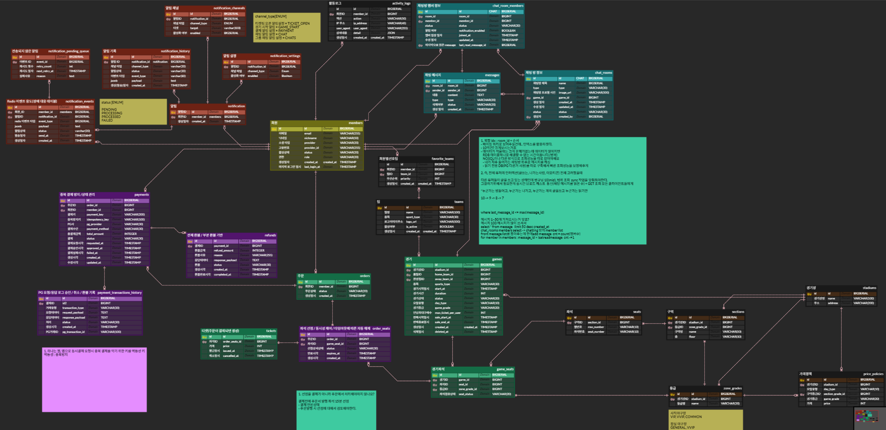

# Sportsify

[](https://github.com/KT-Cloud-2/sportsify_backend/actions/workflows/ci.yml)


스포츠 경기 예매와 팀 응원 채팅을 하나로 합친 서비스

---

## 프로젝트 소개

**Sportsify**는 스포츠 경기 예매부터 실시간 응원까지 끊김 없는 팬 경험을 제공하는 플랫폼입니다.

### 문제 정의

- **시스템 분리**: 예매와 채팅이 서로 다른 앱에서 운영되어 사용자 경험이 단절
- **거래 중심 설계**: 기존 시스템은 결제 위주 설계, 커뮤니티적 가치 제공에 한계
- **팬 활동의 파편화**: 경기 일정 확인, 예매, 응원, 팀 커뮤니티가 각각 다른 플랫폼에 흩어져 있어 팬으로서의 연속적인 경험이 불가능

### MVP 핵심 기능

| 기능 | 설명 |
|---|---|
| 🎫 티켓 예매 | 경기 및 좌석 선택, 다수 좌석 동시 예약 가능 |
| 💳 결제 | Toss Payments 기반 결제 시스템, 결제 무결성 확보 |
| 💬 실시간 채팅 | WebSocket 기반 실시간 메시지 송수신, 응원 활동 지표 |
| 🔔 스마트 알림 | 예매 완료, 경기 시작 등 주요 이벤트 실시간 알림 (Email, MQTT) |

### 기술 목표

- **동시 접속**: MVP 1,000명 안정 처리, 목표 5,000명 대응
- **응답 지연**: 평균 API 200ms, 채팅 메시지 100ms 이하 유지
- **일관성 보장**: DB 트랜잭션 + 분산락으로 중복 예매 방지
- **수평 확장**: Stateless API + Redis 기반 세션 관리로 무장애 운영

### 핵심 기술 챌린지

- **좌석 선점 동시성 제어**: FOR UPDATE + ID 오름차순 정렬 락으로 중복 선점 방지 및 데드락 차단
- **결제 멱등성 및 위변조 검증**: 서버 측 금액 대조 + Idempotency Key 기반 중복 승인 방지
- **실시간 채팅 읽음 배치 플러시**: 대량 읽음 신호를 Redis 임시 저장 → 스케줄러가 배치로 DB 반영하여 쓰기 부하 분산
- **웹소켓 재연결 메시지 재생**: lastMessageId 이후 미수신 메시지를 청크 단위로 유실 없이 재전송
- **Redis Streams 이벤트 드리븐 알림**: 도메인 이벤트를 스트림 큐로 느슨 결합 + 유저별 채널 분기(SSE/Email/MQTT) + 장애 복구 스케줄러
- **대규모 알림 팬아웃**: 수천 명 대상 알림을 청크 분할 + 멀티 스레드 비동기 분산 처리

---

## 기술 스택

| 구분 | 기술 |
|---|---|
| Backend | Java 25, Spring Boot 3.4 |
| Database | PostgreSQL, JPA/QueryDSL |
| Cache/Pub-Sub | Redis 8 (Streams, Sorted Set, SETNX) |
| Infra | Docker, AWS (ALB, EC2, NAT) |
| Monitoring | Prometheus, Grafana |
| External | Kakao/Google OAuth, Toss Payments |

### 아키텍처 특징

- **모노리스 JAR 1개** — 도메인별 패키지 분리 (Ticketing, Payment, Chat, Notification, Game, Member, Team)
- **이벤트 드리븐**: Redis Streams 기반 도메인 간 느슨한 결합
- **캐싱 3단 구조**: Caffeine(L1) → Redis(L2) → DB(L3)


---

## ERD 설계



> 상세 DDL: [docs/02-erd.md](docs/02-erd.md) | ERD Cloud용 DDL: [docs/erd-cloud.sql](docs/erd-cloud.sql)


---

## API

### 보안

- JWT 기반 인증 (Access Token + Refresh Token)
- OAuth2 소셜 로그인 (Google, Kakao)
- Redis 기반 토큰 블랙리스트 + Refresh Token 관리

### 예외 처리

통일된 에러 응답 구조:

```json
{
  "code": "SEAT_ALREADY_RESERVED",
  "message": "이미 선점된 좌석입니다.",
  "detail": null
}
```

### API 문서

- **상세 명세**: [docs/04-api-spec.md](docs/04-api-spec.md)
- **Swagger UI**: 앱 실행 후 `http://localhost:8080/docs.html` 접속

---

## 테스트 및 검증

### 테스트 실행

```bash
./gradlew test
```

리포트 위치: `build/reports/jacoco/test/html/index.html`

### 기본 과정 주요 테스트 목록

#### 예매 (Ticketing)

- **동시성 — 동일 좌석**: 같은 좌석에 다수 유저 동시 요청 → 1명만 성공 (스레드풀 10~200)
- **동시성 — 데드락 방지**: 다중 좌석을 서로 다른 순서로 요청 → ID 정렬 락으로 데드락 없이 처리
- **다중 좌석 정상 흐름**: 충돌 없는 가용 좌석 동시 선점 → 전부 PENDING
- **선점 만료 스케줄러**: 15분 경과 → EXPIRED + 좌석 자동 반납
- **결제 이벤트 연동**: Completed → CONFIRMED + 티켓 발급 / Cancelled → CANCELLED + 좌석 해제

#### 결제 (Payment)

- **금액 위변조 방지**: 클라이언트 금액 ≠ 서버 금액 → 예외 발생
- **PG 승인 + 상태 전환**: Toss API 성공 → DONE + PaymentCompletedEvent 발행
- **외부 API 실패 보상**: PG 호출 실패 → FAIL + 주문/좌석 롤백 이벤트
- **중복 승인 방지**: 동일 결제 건 재요청 → 멱등성 보장 또는 에러 반환
- **결제 취소**: 취소 요청 → Toss 환불 API + CANCELLED 전환

#### 채팅 (Chat)

- **STOMP 권한 검증**: JWT 유효성 + 채팅방 접근 권한 차단/허용
- **메시지 브로드캐스팅**: 전송 → DB 저장 + 구독자 전원 실시간 수신
- **읽음 배치 플러시**: 대량 읽음 신호 → Redis 임시 저장 → 스케줄러 배치 DB 반영
- **미수신 메시지 재생**: 재연결 시 lastMessageId 이후 배치 재전송
- **동시성 — 멤버 관리**: 동시 입장/퇴장/추방 → Advisory Lock 정합성 보장

#### 알림 (Notification)

- **Redis Streams 발행**: 도메인 이벤트 → 알림 스트림 안전 적재
- **대량 팬아웃**: 수천 명 대상 → 청크 분할 + 멀티 스레드 분산 처리
- **채널 분기 필터링**: 유저 설정 조회 → 비활성 제외, 활성 채널(SSE/Email/MQTT) 라우팅
- **SSE 재연결 유실 방지**: Last-Event-ID 기반 미수신 알림 재전송
- **장애 복구 스케줄러**: PROCESSING stuck 감지 → 재시도 또는 FAILED 처리


### 테스트 현황

**전체 533개 테스트 / 실패 0 / 80개 테스트 클래스**

| 지표 | 값 |
|---|---|
| Instruction Coverage | 71% |
| Line Coverage | 61% |
| Branch Coverage | 53% |

| 도메인 | 테스트 클래스 |
|---|---|
| 채팅 | 23 |
| 알림 | 17 |
| 경기/좌석 | 12 |
| 예매 | 11 |
| 회원 | 7 |
| 결제 · 팀 | 4 |

> 단위(Service/Domain) · 통합(TestContainers) · API(MockMvc) 테스트를 GIVEN-WHEN-THEN 패턴으로 작성


---

## 프로젝트 구조

```
src/main/java/com/sportsify/
├── common/                  # 공통 유틸, 예외, Swagger, 알림 발행 인터페이스
│   ├── exception/           # ErrorCode, GlobalExceptionHandler
│   ├── notification/        # NotificationEventPublisher (도메인 공개 계약)
│   └── swagger/             # 커스텀 Swagger 어노테이션
├── member/                  # 회원 · 인증 · 팀
├── game/                    # 경기 · 좌석 · 가격 정책
├── ticketing/               # 예매 · 주문 · 티켓
├── payment/                 # 결제 (Toss Payments 연동)
├── chat/                    # 채팅방 · 메시지 · WebSocket STOMP
└── notification/            # 알림 파이프라인 (설정·채널·발송·이력)
```

각 도메인은 `presentation / application / domain / infrastructure` 4계층으로 분리됩니다.

---

## 로컬 실행 방법

### 1. 최초 1회 셋업

```bash
bash scripts/setup.sh
```

- Git hooks 경로 설정 (`.env` 파일 커밋 방지 pre-commit hook 포함)
- `.env.example` → `.env.local` 복사

이후 `.env.local`에 실제 값을 채웁니다.

### 2. 인프라 실행

```bash
docker compose -f docker-compose.local.yml up -d
```

| 서비스 | 주소 |
|--------|------|
| PostgreSQL | `localhost:5432` |
| Redis | `localhost:6379` |
| Prometheus | `http://localhost:9090` |
| Grafana | `http://localhost:3001` (admin / admin) |

### 3. 애플리케이션 실행

```bash
SPRING_PROFILES_ACTIVE=local ./gradlew bootRun
```

앱 시작 시 Flyway가 DB 스키마를 자동 생성합니다.

| 엔드포인트 | 주소 |
|-----------|------|
| API | `http://localhost:8080` |
| API Docs (Swagger UI / Redoc) | `http://localhost:8080/docs.html` |
| API Spec (JSON) | `http://localhost:8080/v3/api-docs` |

---

## 환경 변수

`.env.example`을 복사해 `.env.local`을 생성한 뒤 아래 값을 채웁니다.

| 변수 | 설명 |
|---|---|
| `DB_URL` | PostgreSQL JDBC URL |
| `DB_USERNAME` / `DB_PASSWORD` | DB 접속 정보 |
| `REDIS_HOST` / `REDIS_PORT` | Redis 접속 정보 |
| `JWT_SECRET` | JWT 서명 키 (256bit 이상) |
| `GOOGLE_CLIENT_ID` / `GOOGLE_CLIENT_SECRET` | Google OAuth2 앱 키 |
| `KAKAO_CLIENT_ID` / `KAKAO_CLIENT_SECRET` | Kakao OAuth2 앱 키 |
| `MAIL_HOST` / `MAIL_USERNAME` / `MAIL_PASSWORD` | SMTP 설정 (알림 Email 발송) |
| `MQTT_BROKER_URL` | Mosquitto 브로커 주소 |

---

## DB 스키마 관리

Flyway 기반으로 관리합니다. 모든 DDL 변경은 migration 파일로만 합니다.

```
src/main/resources/db/migration/
├── V1__init_schema.sql        ← 초기 전체 스키마
├── V2__notification-schema.sql
├── V3__payment_schema.sql
├── V4__payment_order_event.sql
├── V5__ticketing_add_partial_index.sql
└── V6__chat_messages_schema.sql
```

- `ddl-auto: validate` — JPA는 검증만 수행, 스키마 직접 변경 금지

---

## 기여 방법

```bash
# 1. feature 브랜치 생성
git checkout -b feat/your-feature develop

# 2. 개발 후 커밋 (컨벤션: feat: / fix: / refactor: 등)
git commit -m "feat: 기능 설명"

# 3. PR 생성 → develop 브랜치로
# PR 템플릿: .github/pull_request_template.md
```

- 브랜치 전략: `feat/*` → `develop` → `main` (git-flow)
- PR 머지 전 CI 통과 필수
- 코드 리뷰: CodeRabbit 자동 리뷰 + 팀원 1인 승인

---

## 팀 구성

| 이름 | GitHub | 도메인 |
|---|---|---|
| 강정훈 | [@JHKoder](https://github.com/JHKoder) | 회원, 팀, 알림, 인프라 |
| 손하영 | [@glosona](https://github.com/glosona) | 경기/좌석, 예매 |
| 유창민 | [@changmin-yoo](https://github.com/changmin-yoo) | 결제 |
| 주병규 | [@jnj3j3](https://github.com/jnj3j3) | 채팅 |


### 강정훈 — 회원 · 팀 · 알림 · 인프라

| 구분 | 내용 |
|---|---|
| 인증 | OAuth2 소셜 로그인(Google/Kakao), JWT 발급/갱신/블랙리스트, 로그아웃 |
| 회원 | 내 정보 조회/수정, 회원 탈퇴, 선호 팀 CRUD |
| 팀 | 팀 목록/상세 조회, 관리자 팀 등록·수정·비활성화 |
| 알림 | Redis Streams Consumer Group, SSE 실시간 Push, Email/MQTT 멀티채널 발송 |
| 알림 설계 | 즉시/예약 발송 분기, 500명 청크 브로드캐스트, 장애 복구 스케줄러 |
| 인프라 | Docker Compose, GitHub Actions CI, Prometheus + Grafana 모니터링 |

```
[도메인 서비스]
      │ NotificationEventPublisher.publish()
      ▼
[Redis Stream]  (ticket.opened / game.starting / payment.completed / chat.mentioned)
      │ Consumer Group
      ▼
[NotificationEventProcessor]
  ├── 즉시 발송 ──▶ SSE + Email + MQTT
  └── 예약 발송 ──▶ PENDING → 5분 스케줄러 → 발송
```

---

### 손하영 — 경기 · 좌석 · 예매

| 구분 | 내용 |
|---|---|
| 경기 | 목록/상세 조회(등급별 잔여 좌석 요약 포함), 경기 등록 |
| 경기 상태 | `SCHEDULED → ON_SALE → SALE_CLOSED → IN_PROGRESS → FINISHED` 자동 전환 |
| 좌석 | 등급/상태 필터 조회, 경기장×요일×등급 가격 정책 |
| 예매 | DB 비관적 락 기반 좌석 선점, 다중 좌석 All-or-Nothing |
| 주문 만료 | `@Scheduled(fixedRate=60s)` — 15분 미결제 주문 자동 만료 |
| 티켓 발급 | `PaymentCompletedEvent` 수신 시 자동 발급 |

```
[클라이언트]
      │ POST /api/seats/reservations
      ▼
[ReservationService]
  비관적 락(SELECT FOR UPDATE)으로 좌석 상태 확인
      │ AVAILABLE → RESERVED
      ▼
[Order 생성]  expiresAt = now + 15분
      │
      ├── 결제 완료 시 → CONFIRMED + 티켓 발급
      └── 15분 경과 시 → CANCELLED + 좌석 반납
```

---

### 유창민 — 결제

| 구분 | 내용 |
|---|---|
| 결제 생성 | 내부 결제 레코드 생성, Idempotency Key로 중복 결제 방지 |
| 결제 확인 | Toss Payments 승인 후 금액 위변조 서버 검증 및 상태 확정 |
| 결제 취소 | 취소 사유 기록, 상태 CANCELLED 전환 |
| PG 연동 | Toss Payments — `tossOrderId` / `paymentKey` 분리 관리 |

```
[클라이언트]
  1. POST /api/payments         → 결제 레코드 생성 (PENDING)
  2. Toss 결제 위젯 실행
  3. POST /api/payments/confirm → 서버 금액 검증 → COMPLETED
      │ PaymentCompletedEvent 발행
      ▼
  [예매 도메인] 티켓 자동 발급
  [알림 도메인] 결제 완료 알림 발송
```

---

### 주병규 — 채팅

| 구분 | 내용 |
|---|---|
| 채팅방 | 생성(GAME/DIRECT), 목록/상세 조회, 수정, soft delete |
| 참여자 | 입장, 퇴장, 초대(INVITED→JOINED), BAN(재입장 차단) |
| 동시성 | PostgreSQL Advisory Lock — DIRECT 채팅방 중복 생성 방지, 동시 입장 방지 |
| 메시지 | 텍스트 전송 및 DB 저장, 커서 기반 페이지네이션, soft delete |
| 읽음 처리 | `last_read_message_id` 기반 미읽음 카운트 계산, 자동 갱신 |
| STOMP | `/chat.send` / `/chat.read` / `/chat.typing` 메시지 매핑 |

```
[클라이언트]
  WebSocket 연결  ws://host/ws/chat
      │ STOMP CONNECT (JWT 인증)
      ▼
  SUBSCRIBE  /topic/chat/room/{roomId}   ← 채팅방 브로드캐스트
  SUBSCRIBE  /user/queue/chat            ← 개인 메시지
      │
  SEND /chat.send {"roomId": 5, "content": "안녕"}
      ▼
  [ChatStompController] → MessageService → DB 저장
      │ MessageSentEvent
      ▼
  Redis Pub/Sub → 채팅방 구독자 전체 브로드캐스트
```

---

## 문서

| 문서 | 설명 |
|------|------|
| [프로젝트 개요](docs/01-project-overview.md) | 목표, 핵심 기능, 기술 스택, 개발 일정, KPI |
| [ERD](docs/02-erd.md) | 도메인별 테이블 정의, Redis 키 구조, Redis Streams |
| [팀 규칙](docs/03-team-rules.md) | 커밋 컨벤션, 브랜치 전략, 코드 스타일, 패키지 구조 |
| [API 명세서](docs/04-api-spec.md) | 전 도메인 REST API 및 WebSocket 명세 (요청/응답/에러 포함) |
| [ERD Cloud DDL](docs/erd-cloud.sql) | ERD Cloud Import용 MySQL DDL (도메인 설명 포함) |
| [로컬 Docker 가이드](docs/docker-local-guide.md) | 인프라 컨테이너 상세 실행 가이드 |
| [프로젝트 계획](plan.md) | 기능 구현 현황, 스프린트 계획 |


---

## License

This project is for educational purposes.  
© 2025 Sportsify Team (강정훈, 손하영, 유창민, 주병규). All rights reserved.
