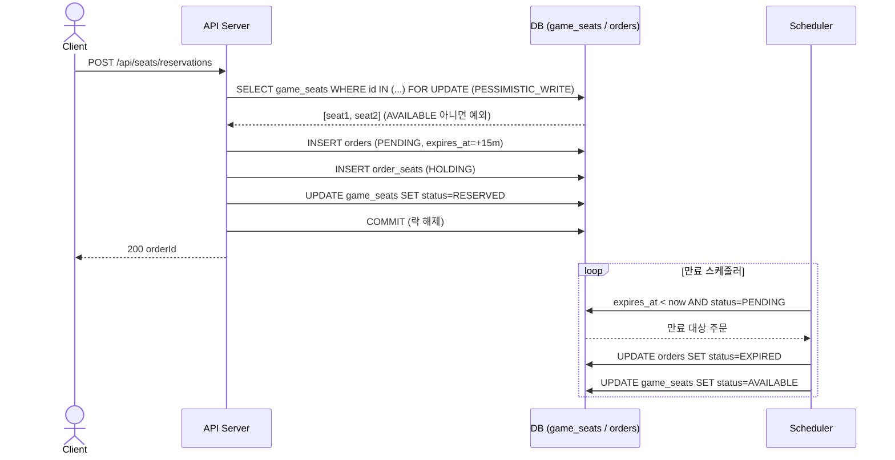
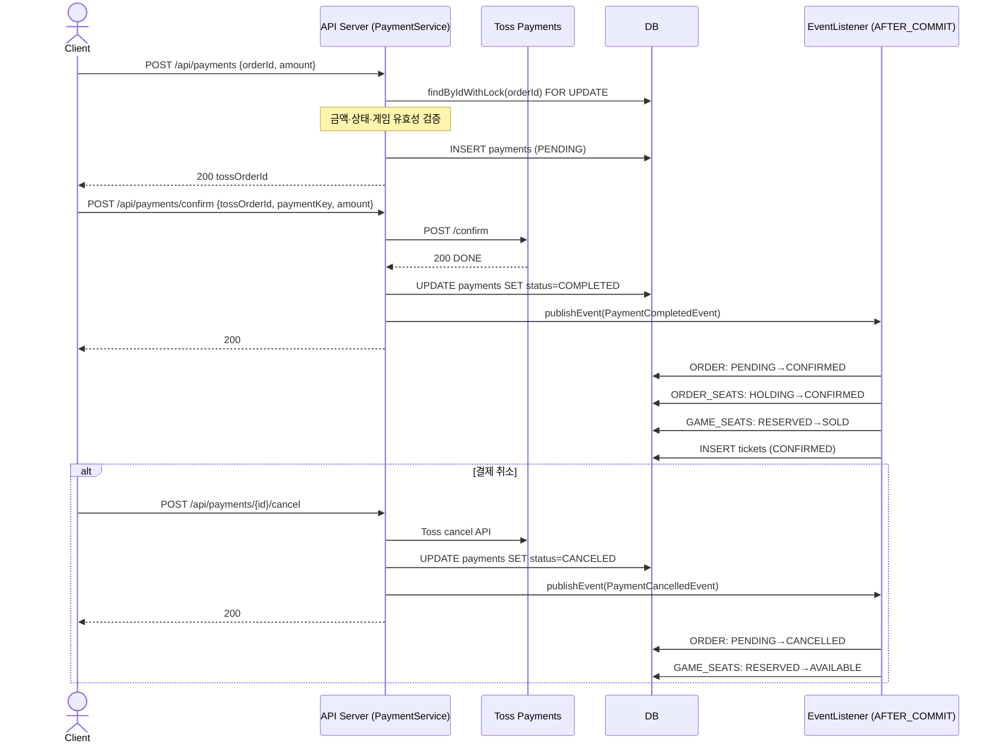
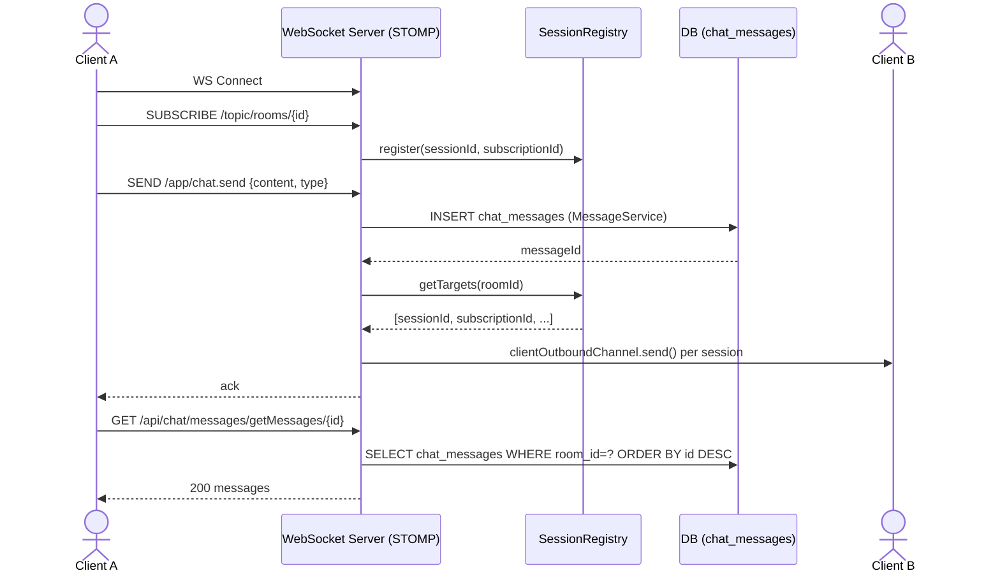
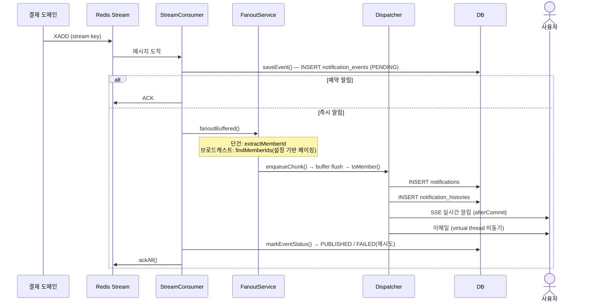

# Sportsify

---

> **Sportsify**는 스포츠 경기 예매부터 실시간 응원까지 끊김 없는 팬 경험을 제공하는 플랫폼입니다.   
> 개발 기간: 2026.04.24 ~ 2026.06.24(2달)

## _intro._

---

프로젝트 주요 기능은 다음과 같습니다.

| 기능        | 설명                                        |
|-----------|-------------------------------------------|
| 🎫 티켓 예매  | 경기 및 좌석 선택, 다수 좌석 동시 예약 가능                |
| 💳 결제     | Toss Payments 기반 결제 시스템, 결제 무결성 확보        |
| 💬 실시간 채팅 | WebSocket 기반 실시간 메시지 송수신, 응원 활동 지표        |
| 🔔 스마트 알림 | 예매 완료, 경기 시작 등 주요 이벤트 실시간 알림 (SSE, Email) |

  

 

## _Documents._

- [프로젝트 개요](docs/01-project-overview.md)
- [팀 규칙 컨벤션](docs/03-team-rules.md)
- [API 명세서](docs/04-api-spec.md)

## _ER Diagram._

## _Stack._

> backend

- Java25,Spring Boot 4.0.3,
- JWT,Spring Security,Oauth2
- JPA/QueryDSL,
- PostgreSQL18,Redis8
- JUnit5,Mock
- Prometheus, Grafana, JMeter

> Collaborations

- Slack
- Notion

## _SW Architecture._

## _Member._

|                                                               **강정훈**                                                               |                                                             **주병규**                                                              |                                                              **손하영**                                                               |                                                                     **유창민**                                                                     | 
|:-----------------------------------------------------------------------------------------------------------------------------------:|:--------------------------------------------------------------------------------------------------------------------------------:|:----------------------------------------------------------------------------------------------------------------------------------:|:-----------------------------------------------------------------------------------------------------------------------------------------------:| 
| [   @JHkoder](https://github.com/JHkoder) | [   @jnj3j3](https://github.com/jnj3j3) | [   @glosona](https://github.com/glosona) | [   @dnwn3295-lgtm](https://github.com/dnwn3295-lgtm) | 
|                                                                 알림                                                                  |                                                                채팅                                                                |                                                                티켓팅                                                                 |                                                                       결제                                                                        |

 

## _Sequence Diagram._

### 1. 좌석 선점

```mermaid
sequenceDiagram
    actor Client
    participant API as API Server
    participant DB as DB (game_seats / orders)
    participant Scheduler

    Client->>API: POST /api/seats/reservations
    API->>DB: SELECT game_seats WHERE id IN (...) FOR UPDATE (PESSIMISTIC_WRITE)
    DB-->>API: [seat1, seat2] (AVAILABLE 아니면 예외)
    API->>DB: INSERT orders (PENDING, expires_at=+15m)
    API->>DB: INSERT order_seats (HOLDING)
    API->>DB: UPDATE game_seats SET status=RESERVED
    API->>DB: COMMIT (락 해제)
    API-->>Client: 200 orderId

    loop 만료 스케줄러
        Scheduler->>DB: expires_at < now AND status=PENDING
        DB-->>Scheduler: 만료 대상 주문
        Scheduler->>DB: UPDATE orders SET status=EXPIRED
        Scheduler->>DB: UPDATE game_seats SET status=AVAILABLE
    end
```

### 2. 결제

```mermaid
sequenceDiagram
    actor Client
    participant API as API Server (PaymentService)
    participant Toss as Toss Payments
    participant DB
    participant Listener as EventListener (AFTER_COMMIT)

    Client->>API: POST /api/payments {orderId, amount}
    API->>DB: findByIdWithLock(orderId) FOR UPDATE
    Note over API: 금액·상태·게임 유효성 검증
    API->>DB: INSERT payments (PENDING)
    API-->>Client: 200 tossOrderId

    Client->>API: POST /api/payments/confirm {tossOrderId, paymentKey, amount}
    API->>Toss: POST /confirm
    Toss-->>API: 200 DONE
    API->>DB: UPDATE payments SET status=COMPLETED
    API->>Listener: publishEvent(PaymentCompletedEvent)
    API-->>Client: 200

    Listener->>DB: ORDER: PENDING→CONFIRMED
    Listener->>DB: ORDER_SEATS: HOLDING→CONFIRMED
    Listener->>DB: GAME_SEATS: RESERVED→SOLD
    Listener->>DB: INSERT tickets (CONFIRMED)

    alt 결제 취소
        Client->>API: POST /api/payments/{id}/cancel
        API->>Toss: Toss cancel API
        API->>DB: UPDATE payments SET status=CANCELED
        API->>Listener: publishEvent(PaymentCancelledEvent)
        API-->>Client: 200
        Listener->>DB: ORDER: PENDING→CANCELLED
        Listener->>DB: GAME_SEATS: RESERVED→AVAILABLE
    end
```

### 3. 채팅

```mermaid
sequenceDiagram
    actor ClientA as Client A
    participant WS as WebSocket Server (STOMP)
    participant Registry as SessionRegistry
    participant DB as DB (chat_messages)
    actor ClientB as Client B

    ClientA->>WS: WS Connect
    ClientA->>WS: SUBSCRIBE /topic/rooms/{id}
    WS->>Registry: register(sessionId, subscriptionId)

    ClientA->>WS: SEND /app/chat.send {content, type}
    WS->>DB: INSERT chat_messages (MessageService)
    DB-->>WS: messageId
    WS->>Registry: getTargets(roomId)
    Registry-->>WS: [sessionId, subscriptionId, ...]
    WS->>ClientB: clientOutboundChannel.send() per session
    WS-->>ClientA: ack

    ClientA->>WS: GET /api/chat/messages/getMessages/{id}
    WS->>DB: SELECT chat_messages WHERE room_id=? ORDER BY id DESC
    WS-->>ClientA: 200 messages
```

### 4. 알림

```mermaid
sequenceDiagram
    participant Domain as 결제 도메인
    participant Stream as Redis Stream
    participant Consumer as StreamConsumer
    participant Fanout as FanoutService
    participant Dispatcher
    participant DB
    actor User as 사용자

    Domain->>Stream: XADD (stream key)
    Stream->>Consumer: 메시지 도착
    Consumer->>DB: saveEvent() — INSERT notification_events (PENDING)

    alt 예약 알림
        Consumer->>Stream: ACK
    else 즉시 알림
        Consumer->>Fanout: fanoutBuffered()
        note over Fanout: 단건: extractMemberId<br/>브로드캐스트: findMemberIds(설정 기반 페이징)
        Fanout->>Dispatcher: enqueueChunk() → buffer flush → toMember()
        Dispatcher->>DB: INSERT notifications
        Dispatcher->>DB: INSERT notification_histories
        Dispatcher->>User: SSE 실시간 알림 (afterCommit)
        Dispatcher->>User: 이메일 (virtual thread 비동기)
        Consumer->>DB: markEventStatus() → PUBLISHED / FAILED(재시도)
        Consumer->>Stream: ackAll()
    end
```

## _Test._

### 1) 트래픽 산정

| **구분**      | **평시**       | **피크시**           |
|-------------|--------------|-------------------|
| DAU         | **3,000명**   | **3,000명**        |
| CCU         | **300명**     | **500명 ~ 1,000명** |
| WebSocket   | 300          | 500 ~ 1000        |
| 예상 Peak TPS | **약 30 TPS** | **167 ~ 333 TPS** |

#### 산정 근거

| **서비스**        | **DAU 추정**   | **근거**     |
|----------------|--------------|------------|
| 인터파크 티켓        | 50~100만 (피크) | 인기 공연 오픈 시 |
| 멜론 티켓          | 10~30만       | 평시 기준      |
| 소규모 스포츠 티켓 플랫폼 | 1~5만         | 지역 리그 수준   |

→ 소규모 기준 3~5만 DAU의 1/20 적용 = **DAU 3,000명**  
→ CCU: DAU의 10% = **300명** (채팅 체류시간 고려, 일반 서비스 5%보다 높게 산정)

### 2) 목표 성능 지표

| **시나리오**         | **목표 RPS** | **현실적 TPS** | **성공률** |
|------------------|------------|-------------|---------|
| 일반 부하 (CCU 200)  | 50         | 40~50       | ≥ 99.9% |
| 피크 부하 (CCU 500)  | 200        | 150~200     | ≥ 99.0% |
| 스트레스 (CCU 1,000) | 400        | 200~300     | ≥ 95.0% |

---

## License

This project is for educational purposes.  
© 2025 Sportsify Team (강정훈, 손하영, 유창민, 주병규). All rights reserved.
